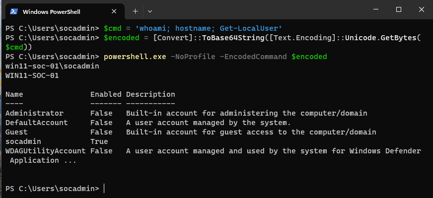
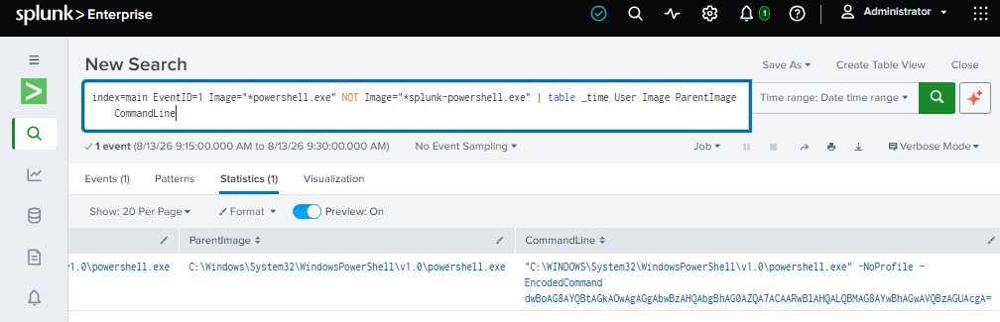
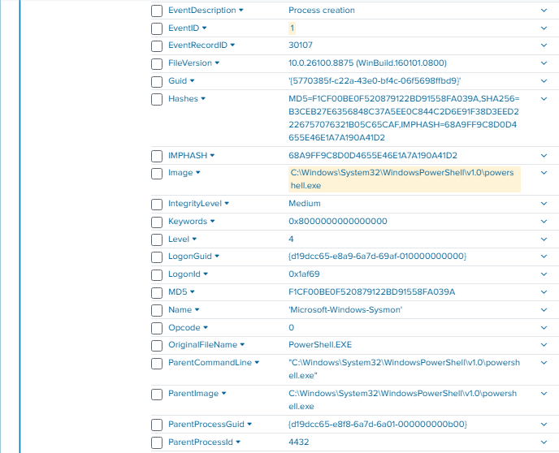
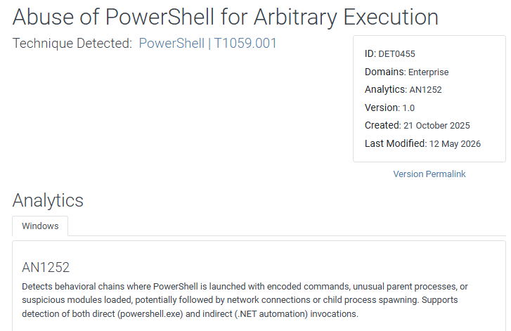
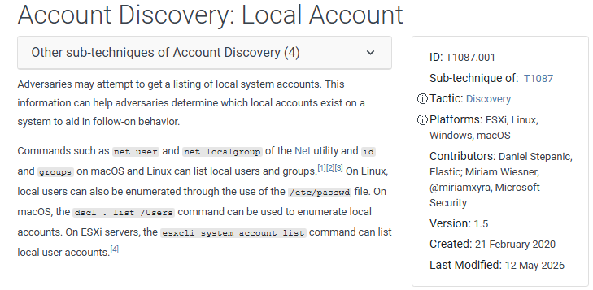

# SIEM Detection Lab — PowerShell Investigation with Splunk & Sysmon

## Overview

This project demonstrates a hands-on SOC investigation of suspicious PowerShell activity in a Windows 11 endpoint environment.

The lab simulates execution of a Base64-encoded PowerShell command, collects endpoint telemetry with Sysmon, forwards the events into Splunk, and investigates the activity from a SOC analyst perspective.

The investigation focuses on identifying suspicious command-line execution, decoding the PowerShell payload, reviewing Sysmon telemetry, and mapping the observed behavior to the MITRE ATT&CK framework.

## Lab Architecture

The environment consists of:

- Windows 11 SOC endpoint
- Sysmon for endpoint telemetry
- Splunk for log ingestion, searching, and investigation
- PowerShell for simulated suspicious activity
- MITRE ATT&CK for technique mapping

## Investigation Scenario

A Base64-encoded PowerShell command was executed on the Windows endpoint to simulate behavior commonly observed during malicious PowerShell activity.

The command collected basic system and account information:

- Current user context
- Hostname
- Local user accounts

The objective was to determine whether the activity could be detected in Splunk, reconstruct the executed command, and identify the relevant MITRE ATT&CK techniques.

## 1. Encoded PowerShell Execution

The PowerShell command was converted to Base64 and executed using the `-EncodedCommand` parameter.

This provides a controlled example of command-line obfuscation that a SOC analyst may encounter during alert triage.

## 2. Detection in Splunk

Sysmon telemetry from the Windows endpoint was ingested into Splunk.

The investigation identified the PowerShell process execution and exposed command-line artifacts associated with the encoded command.

This demonstrates the value of process creation telemetry for detecting suspicious PowerShell behavior.

## 3. Base64 Payload Decoding

The encoded PowerShell payload was decoded to recover the original command.

Decoded activity showed execution of:

`whoami; hostname; Get-LocalUser`

This allowed the activity to be interpreted in its original form rather than relying only on the encoded command line.

## 4. Sysmon Event Investigation

Sysmon process telemetry was reviewed to validate the execution and provide additional endpoint context.

The investigation focused on process creation information and command-line visibility that could be used during SOC triage and incident investigation.

## MITRE ATT&CK Mapping

### T1059.001 — Command and Scripting Interpreter: PowerShell

The observed use of PowerShell maps to MITRE ATT&CK technique **T1059.001 — PowerShell**.

PowerShell can be used by adversaries to execute commands, scripts, and payloads on Windows systems.

### T1087.001 — Account Discovery: Local Account

Execution of `Get-LocalUser` enumerated local user accounts on the endpoint.

This behavior maps to **T1087.001 — Account Discovery: Local Account**.

## SOC Analyst Takeaways

This lab demonstrates several core SOC investigation skills:

- Detecting suspicious PowerShell execution in a SIEM
- Investigating endpoint process telemetry
- Analyzing command-line activity
- Decoding Base64-obfuscated PowerShell
- Correlating SIEM and endpoint evidence
- Mapping observed behavior to MITRE ATT&CK
- Documenting an investigation with supporting evidence

## Tools & Technologies

- Splunk
- Sysmon
- Windows 11
- PowerShell
- VMware Fusion
- MITRE ATT&CK

## Conclusion

This investigation demonstrates an end-to-end detection workflow from simulated endpoint activity to SIEM analysis and ATT&CK mapping.

The project is designed to reflect the type of investigation workflow performed by a Tier 1 SOC analyst when reviewing suspicious PowerShell activity and validating endpoint telemetry.
