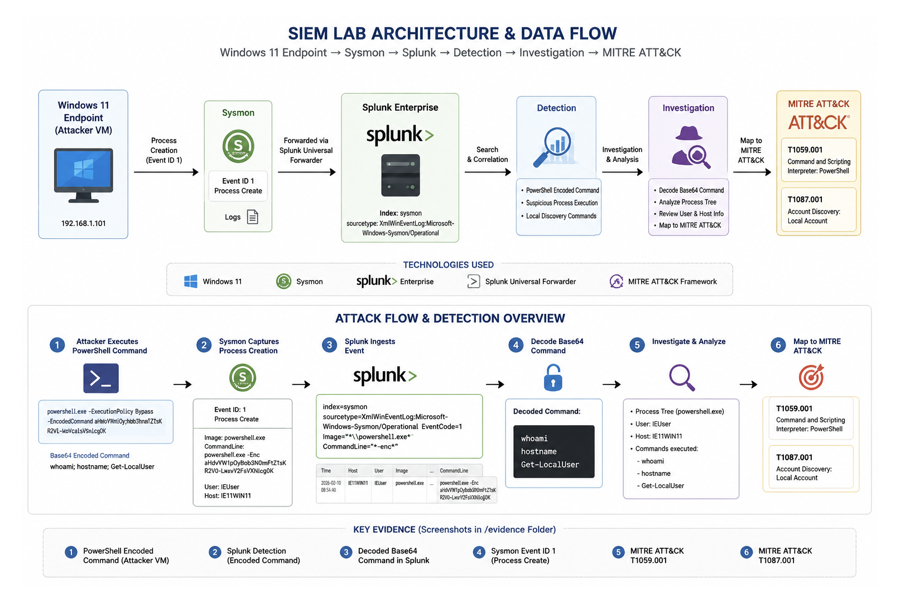
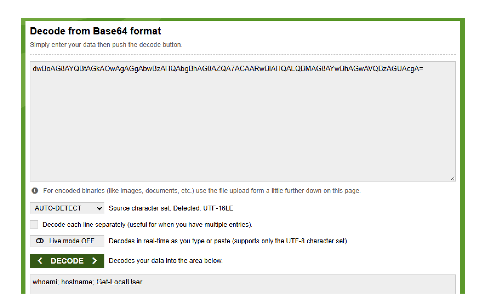

# SIEM Detection Lab — PowerShell Investigation with Splunk & Sysmon

## Overview

This project demonstrates a hands-on SOC investigation of suspicious PowerShell activity in a Windows 11 endpoint environment.

The lab simulates execution of a Base64-encoded PowerShell command, collects endpoint telemetry with Sysmon, forwards the events into Splunk, and investigates the activity from a SOC analyst perspective.

The investigation focuses on identifying suspicious command-line execution, decoding the PowerShell payload, reviewing Sysmon telemetry, and mapping the observed behavior to the MITRE ATT&CK framework.

## Lab Architecture

The environment consists of:

- Windows 11 SOC endpoint
- Sysmon for endpoint telemetry
- Splunk for log ingestion, searching, and investigation
- PowerShell for simulated suspicious activity
- MITRE ATT&CK for technique mapping



## Investigation Scenario

A Base64-encoded PowerShell command was executed on the Windows endpoint to simulate behavior commonly observed during malicious PowerShell activity.

The command collected basic system and account information:

- Current user context
- Hostname
- Local user accounts

The objective was to determine whether the activity could be detected in Splunk, reconstruct the executed command, and identify the relevant MITRE ATT&CK techniques.

## 1. Encoded PowerShell Execution

The PowerShell command was converted to Base64 and executed using the `-EncodedCommand` parameter.

This provides a controlled example of command-line obfuscation that a SOC analyst may encounter during alert triage.


## 2. Detection in Splunk

Sysmon telemetry from the Windows endpoint was ingested into Splunk.

The investigation identified the PowerShell process execution and exposed command-line artifacts associated with the encoded command.

This demonstrates the value of process creation telemetry for detecting suspicious PowerShell behavior.

### SPL Detection Query

The following SPL query was used to identify PowerShell process execution while excluding Splunk's own PowerShell process to reduce false positives:

```spl
index=main EventID=1 Image="*powershell.exe" NOT Image="*splunk-powershell.exe"
| table _time User Image ParentImage CommandLine

This search focuses on Sysmon Event ID 1 (Process Creation) and returns the user, process image, parent process, and command-line arguments for investigation.


### Detection Logic & False Positive Analysis

The detection identifies `powershell.exe` process creation events (Sysmon Event ID 1) while excluding Splunk's own internal PowerShell process (`Image="*splunk-powershell.exe"`) to reduce known noise. The `CommandLine` field is then reviewed during investigation for suspicious arguments such as `-EncodedCommand`.

The presence of `-EncodedCommand` is suspicious, but not inherently malicious. Encoding may be used legitimately to reliably pass scripts or arguments containing quotes, special characters, or complex command structures. For example, software deployment tools, endpoint management platforms, RMM solutions, and automation frameworks may invoke encoded PowerShell.

During triage, an analyst should review additional context before escalating, including:

- Parent process
- User context
- Host and asset role
- Decoded command contents
- Execution frequency
- Related process activity
- Network connections
- Whether the behavior is expected for the system or user

For this reason, `-EncodedCommand` should be treated as an investigative indicator rather than standalone proof of malicious activity.

### Detection Limitations & Evasion

The current detection is intentionally simple and focuses on `powershell.exe` executions containing the `-EncodedCommand` parameter. As a result, it should not be considered comprehensive PowerShell detection coverage.

An adversary may attempt to evade narrowly defined command-line detection by:

- Using abbreviated PowerShell parameters such as `-enc` instead of `-EncodedCommand`
- Executing PowerShell through `pwsh.exe` rather than `powershell.exe`
- Renaming or copying the PowerShell executable
- Using alternative execution methods that do not contain the expected command-line pattern

Renaming `powershell.exe` could bypass detection logic that relies only on the `Image` field. However, Sysmon also records the executable's `OriginalFileName` metadata, which can still identify a renamed PowerShell binary. A more resilient detection could therefore correlate `Image`, `OriginalFileName`, command-line arguments, and process ancestry.

More broadly, robust PowerShell detection should combine command-line analysis with process relationships, user context, PowerShell logging, endpoint telemetry, and behavioral indicators rather than relying on a single string match.

## 3. Base64 Payload Decoding

The encoded PowerShell payload was decoded to recover the original command.

Decoded activity showed execution of:

`whoami; hostname; Get-LocalUser`

This allowed the activity to be interpreted in its original form rather than relying only on the encoded command line.



## 4. Sysmon Event Investigation

Sysmon process telemetry was reviewed to validate the execution and provide additional endpoint context.

The investigation focused on process creation information and command-line visibility that could be used during SOC triage and incident investigation.


## MITRE ATT&CK Mapping

### T1059.001 — Command and Scripting Interpreter: PowerShell

The observed use of PowerShell maps to MITRE ATT&CK technique **T1059.001 — PowerShell**.

PowerShell can be used by adversaries to execute commands, scripts, and payloads on Windows systems.


### T1087.001 — Account Discovery: Local Account

Execution of `Get-LocalUser` enumerated local user accounts on the endpoint.

This behavior maps to **T1087.001 — Account Discovery: Local Account**.


## SOC Analyst Takeaways

This lab demonstrates several core SOC investigation skills:

- Detecting suspicious PowerShell execution in a SIEM
- Investigating endpoint process telemetry
- Analyzing command-line activity
- Decoding Base64-obfuscated PowerShell
- Correlating SIEM and endpoint evidence
- Mapping observed behavior to MITRE ATT&CK
- Documenting an investigation with supporting evidence

## Tools & Technologies

- Splunk
- Sysmon
- Windows 11
- PowerShell
- VMware Fusion
- MITRE ATT&CK

## Lessons Learned

The most challenging part of this lab was not generating the PowerShell activity itself, but building a reliable telemetry pipeline. I had to configure the Windows 11 endpoint, Sysmon, Splunk Universal Forwarder, and Splunk Enterprise so that the components could communicate correctly and Sysmon events were successfully ingested and searchable in the SIEM.

Building the detection reinforced the importance of tuning detection logic rather than simply searching for suspicious strings. Splunk's own `splunk-powershell.exe` activity created unnecessary matches, so I excluded it from the search to reduce known noise while preserving visibility into the simulated PowerShell execution.

This lab helped me better understand the complete SOC investigation workflow from endpoint activity to analyst decision-making. PowerShell execution generates endpoint telemetry, Sysmon records the process activity, Splunk ingests the event, detection logic identifies suspicious behavior, and the analyst investigates and decodes the Base64 command to determine what was actually executed.

The investigation also reinforced that a detection hit is only the beginning of the triage process. An indicator such as `-EncodedCommand` can be suspicious without being inherently malicious, so process context, user activity, decoded command contents, related telemetry, and expected system behavior must be considered before determining whether an event should be escalated.

This lab intentionally used a relatively simple attack simulation. Future improvements could build on this foundation with more realistic attack scenarios, additional telemetry sources, more resilient detection logic, automated alerting, and correlation across multiple security data sources.

## Conclusion

This investigation demonstrates an end-to-end detection workflow from simulated endpoint activity to SIEM analysis and ATT&CK mapping.

The project is designed to reflect the type of investigation workflow performed by a Tier 1 SOC analyst when reviewing suspicious PowerShell activity and validating endpoint telemetry.
